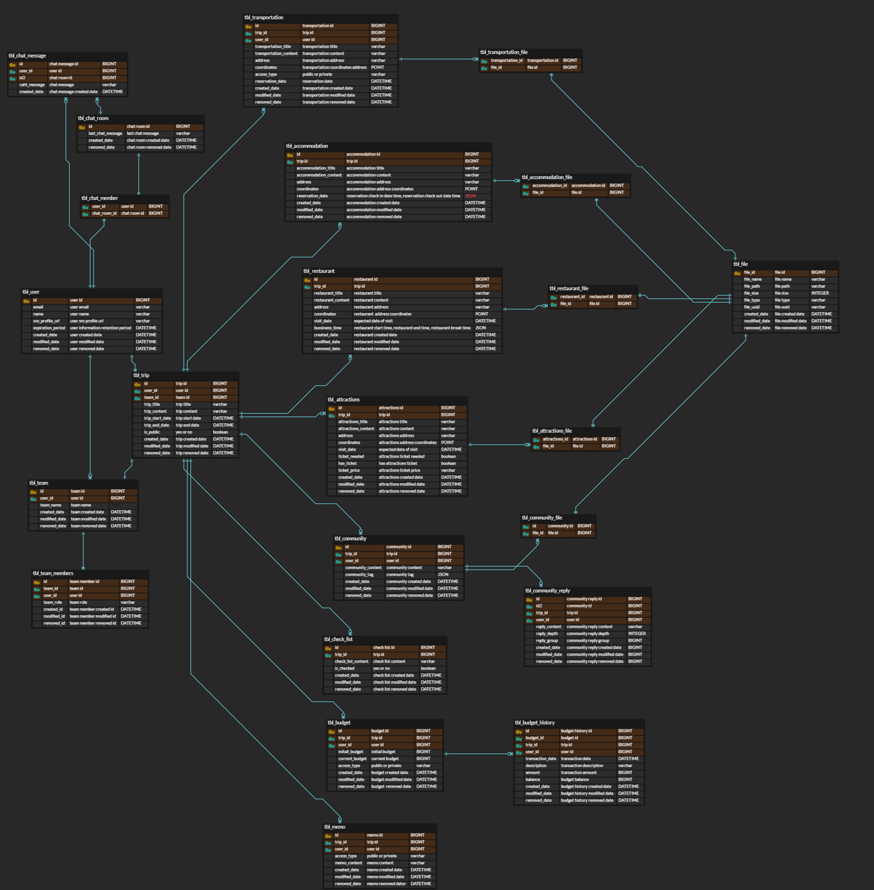

# 🗒 여행 관리 프로젝트

여행 계획을 한눈에 파악할 수 있고, 팀원과 계획을 공유하고 함께 수정할 수 있으며, 
커뮤니티를 통해 나의 여행 계획과 사진 등을 공유할 수 있는 서비스입니다.

## 프로젝트 기능 및 설계
1. 회원관리

   ① 회원가입
   - 소셜로그인으로만 회원가입(oauth2.0)
   - 구글, 카카오, 네이버
   
   ② 로그인, 로그아웃
   - jwt로 토큰 사용
   - 인증, 인가
   
   ③ 팀 관리
   - 여행을 주최한 사용자가 팀원을 추가, 삭제
   - 한 사람이 여러 여행을 계획한다면 여러 팀이 생성 가능
   
   ④ 회원 탈퇴
   - 로그인 상태에서만 회원탈퇴가 가능
   - 회원 정보는 유효기간 후에 완전 삭제

2. 여행관리(등록/수정/삭제)
   - 여행 제목, 전체 여행 날짜 등록
   - 공개/비공개 설정
   -> 팀원은 항상 공개이며 여행 계획 내용 수정 가능
   > 팀원 공유로 인한 ***동시성 이슈***는 **lock**을 사용하여 해결

   
3. 교통관리(등록/수정/삭제) 
   - 교통편 제목, 간단 설명 등록(제목은 필수, 설명은 옵션)
   - 교통편 날짜/시간 등록
   - 개인용 교통편인지 팀용 교통편인지 체크 -> 공용으로 등록한 교통편과, 개인 교통편만 볼 수 있음
   - 교통편 탑승 위치 등록(주소, 위도, 경도 - 지도 api사용)
   - 사진 첨부 가능(예, 표 사진등..)

4. 숙소관리(등록/수정/삭제)
   - 제목, 간단 설명 등록(제목은 필수, 설명은 옵션)
   - 내가 계획한 체크인, 체크아웃 시간 등록
   - 체크인, 체크아웃 날짜/시간 등록
   - 숙소 위치 등록(주소, 위도, 경도 - 지도 api사용)
   - 사진 첨부 가능(예, 숙소 사진등..)

5. 식당관리(등록/수정/삭제)
   - 제목, 간단 설명 등록(제목은 필수, 설명은 옵션)
   - 내가 계획한 식당 방문 시간 등록
   - 영업시간, 브레이크 타임 등록 
   - 식당 예약 정보 등록
   - 식당 위치 등록(주소, 위도, 경도 - 지도 api사용)
   - 사진 첨부 가능(예, 메뉴 등..)

6. 관광관리(등록/수정/삭제)
   - 제목, 간단 설명 등록(제목은 필수, 설명은 옵션) 
   - 내가 계획한 관광지 시간 등록
   - 관광 위치 등록(주소, 위도, 경도 - 지도 api사용) 
   - 필요한 티켓 여부 및 티켓 필요할 경우 구매여부, 가격 등록 (예, 뮤지컬 티켓, 디즈니 티켓 등등..)
   - 사진 첨부 가능(예, QR코드 사진 등..)

7. 체크리스트 관리(등록/수정/삭제)
   - 준비물 체크, 티켓 출력체크 등등 체크리스트 등록
   - 체크한 리스트의 체크 기능

8. 가계부(등록/수정/삭제)

   ① 팀 공유 가계부
   - 초기 예산 등록
   - 사용 내역 등록
   - 정산 내역 출력
  
   ② 개인 가계부
   - 초기 예산 등록
   - 사용 내역 등록

9. 메모(등록/수정/삭제)
   - 위의 내용 이외의 내용들 등록
   - 한 여행 당 두개 메모(팀, 개인)
   
   ① 팀 공유 메모
   - 팀 공개

   ② 개인 메모
   - 비공개

10. 여행 목록
    - 전체 여행 목록 리스트로 가져오기(시간 순)
    - 각 카테고리 별 정보 리스트로 가져오기(시간 순)
    - 여행 별 정보들을 리스트로 가져오기(시간 순)
    -> 여행 전체의 시간 순 계획들을 보여줌

11. 커뮤니티(등록/수정/삭제)
    - 자신의 여행 계획 리스트와 사진, 내용 등을 공유
    - 태그와 함께 글 등록 -> 한개 이상 등록 필수
    - 댓글, 대 댓글
    - 관심 여행 키워드 검색 -> 등록된 태그를 기준으로 키워드 검색

## 추가 기능
- stomp을 이용한 채팅기능
- 커뮤니티 검색 시 추천 알고리즘 사용

## ERD 

## Trouble Shooting
[go to the trouble shooting section](doc/TROUBLE_SHOOTING.md)

### Tech Stack

 
    
    
    
   
   

